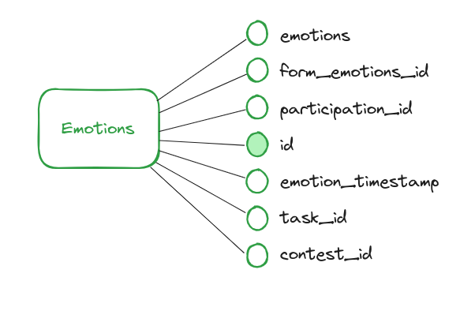
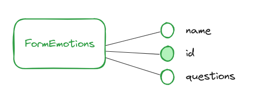
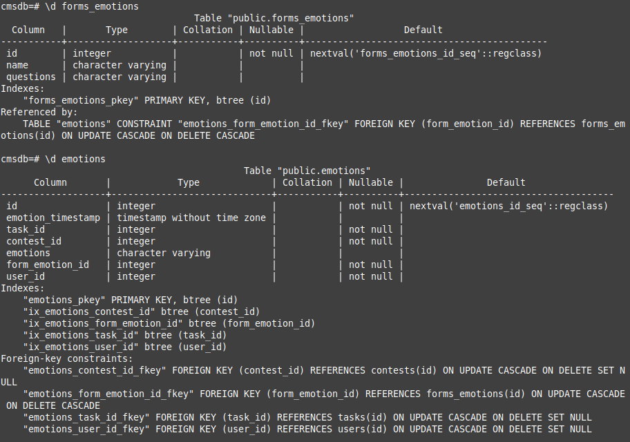
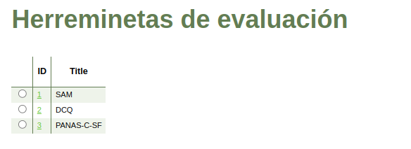
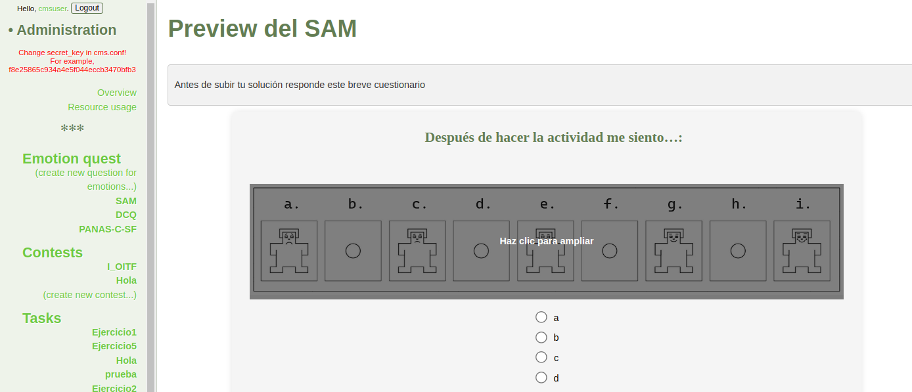
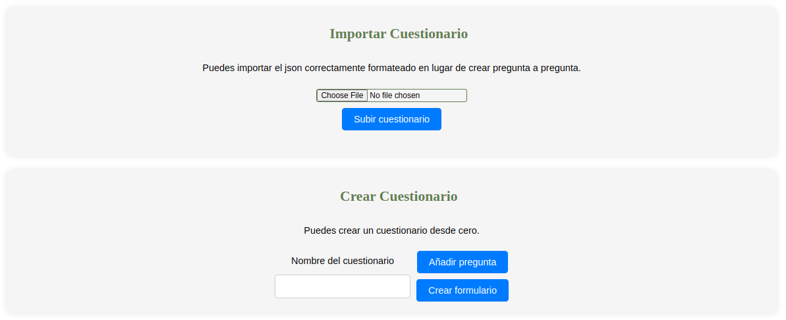
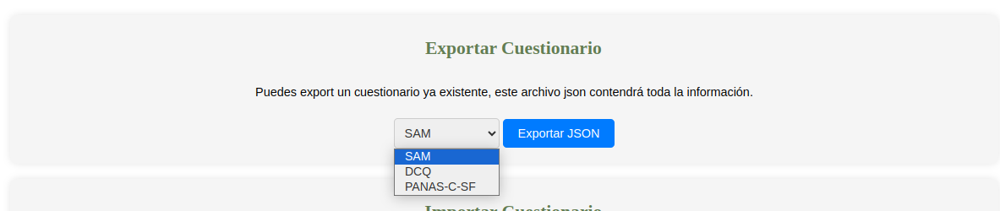
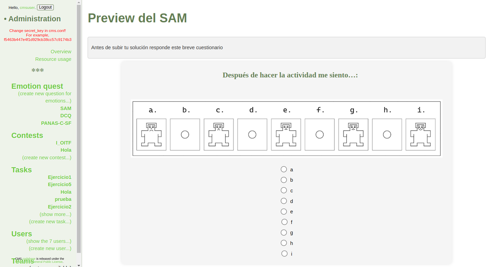
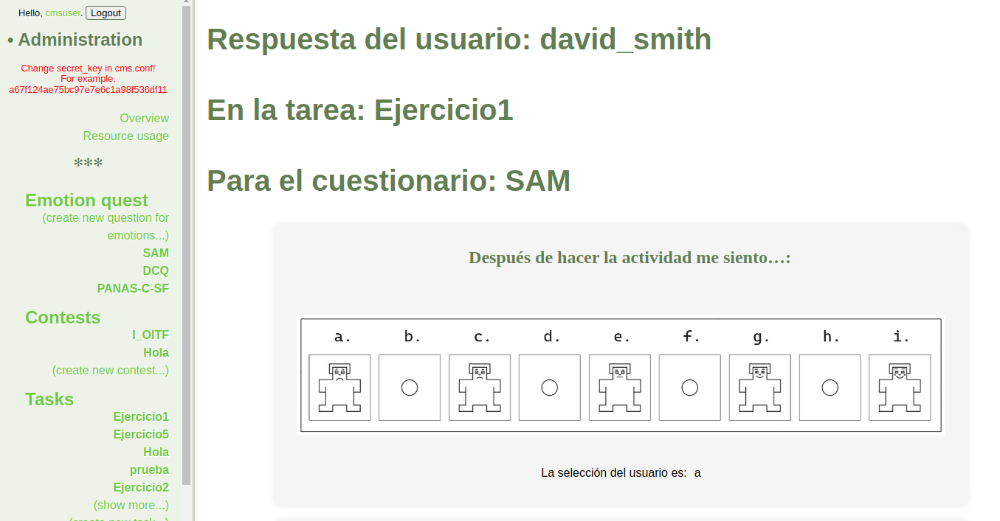

# emotions.module.eLL.CMS

Emotions Module for the eLL-CMS Sytems

### Author: Daniel Felipe Gomez Aristizabal

### Tutor: Coromoto Leon Hernandez

### Co-Tutor: Rafael Herrero Alvarez

## Demo

If you are student from the University of La Laguna and you want to see the system working you can access to the following link, remember use the VPN of the University of La Laguna.

- Access as Admin of CMS:
url: 10.6.128.159:8089

- Access as participant of CMS:
url: 10.6.128.159:8088

You will need to use credentials to access the system. Please if you don't have yet the credentials contact me to the email:

alu0101438139@ull.edu.es

## Description

This repository contains the Emotions Module for the eLL-CMS Systems. This work is part of my Thesis Project for the Degree of Computer Science at the University of La Laguna. The system is based on the [Contest Management System (CMS)](https://github.com/cms-dev/cms/tree/v1.4), a distributed system for running and (to some extent) organizing a programming contest.

The repository includes the various modifications enabling the system to measure emotions during the process of solving programming activities to help develop the computational thinking of students.

With these modifications, we add the following features:

- **Creation of a new entity called Emotion** to store the emotions of the students.

- **Creation of a new entity called FormEmotion** to store forms measuring the emotions of the students.

- **Creation of a new relationships between the old entities and the new entities** to store the emotions of the students and access the information correctly.

- **Creation of varios screens to offer different ways to manage the emotions and the measures of the emotions**.

- **Creation of forms to measure the emotions of the students.** Administrators can create forms to measure the emotions of the students. These forms can be added by importing a JSON file with the structure of the form. Another way is to create the form in the system by answering the questions to indicate the type of each question, an optional statement, and an optional image.

- **Exportation of the created forms** Administrators can export the forms created in the system to a JSON file. The JSON file contains the structure of the created form.

- **Dinamically representation of the forms created.** The forms created are represented dynamically in the system, allowing students to answer the questions on the form.

- **Creation of diferents tools to view the measurents obteined.** The system offers many ways to view the measurements obtained. Administrators can view the measurements in a table, graph, or pie chart. The system allows filtering the measurements by date, form, student, and activity.

## Installation

As mentioned before, this repository is the result of the modifications proposed in my thesis project. The installation instructions for this repository and the CMS are explained in the thesis documentation. The thesis is in Spanish and is available in the thesis repository of the University of La Laguna.

